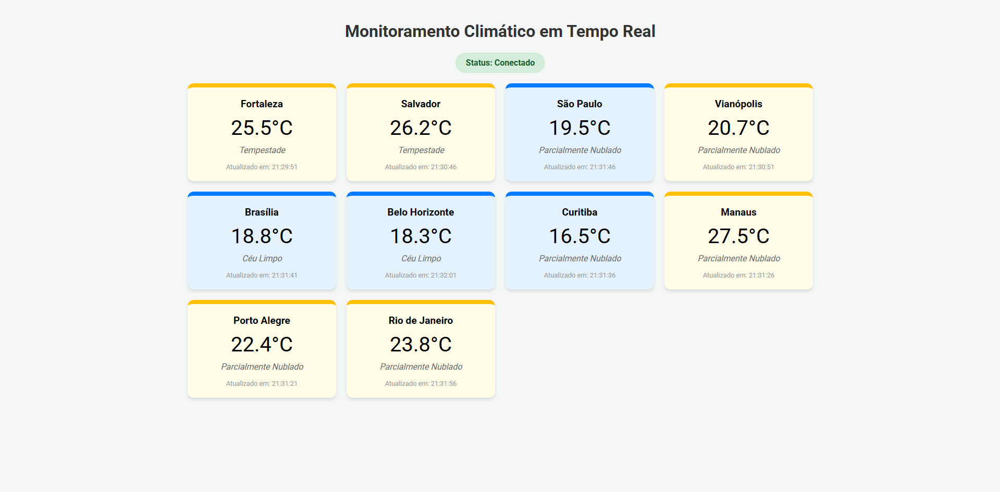

# Monitoramento de Temperatura em Tempo Real com WebSockets

Este projeto implementa um sistema distribuído de monitoramento climático utilizando o protocolo STOMP sobre WebSockets com Spring Boot. O sistema demonstra a capacidade de um servidor "empurrar" (push) dados para múltiplos clientes em tempo real.

## 🚀 Como Rodar o Projeto

1. **Pré-requisitos:**
   - Java 17 ou superior
   - Maven

2. **Passos:**
   - Clone o repositório.
   - Navegue até a pasta raiz do projeto.
   - Execute o comando:
     ```bash
     ./mvnw spring-boot:run
     ```
   - Acesse no navegador: `http://localhost:8080`

## 📡 Fluxo de Mensagens

1. **Servidor (Spring Boot):**
   - Um serviço agendado (`@Scheduled`) é executado a cada 5 segundos.
   - O servidor escolhe aleatoriamente uma de 10 cidades pré-definidas.
   - Consulta a temperatura atual e a condição climática via API **Open-Meteo**.
   - Os dados são empacotados em um objeto JSON.
   - O servidor envia o JSON para o tópico `/topic/clima` via **SimpMessagingTemplate**.

2. **Cliente (Web):**
   - O cliente estabelece uma conexão WebSocket usando **SockJS** e **STOMP**.
   - O cliente se inscreve (`subscribe`) no tópico `/topic/clima`.
   - Ao receber uma mensagem, o cliente atualiza dinamicamente o Dashboard, criando ou atualizando cards para cada cidade.
   - A cor do card muda conforme a temperatura (Azul para < 20°C, Amarelo para 20-28°C, Vermelho para > 28°C).

## 🖥️ Demonstração



## 🛠️ Tecnologias Utilizadas

- **Backend:** Spring Boot, Spring WebSocket, RestTemplate, Scheduling.
- **Frontend:** HTML5, CSS3, JavaScript (SockJS, STOMP.js).
- **Dados:** Open-Meteo API.
